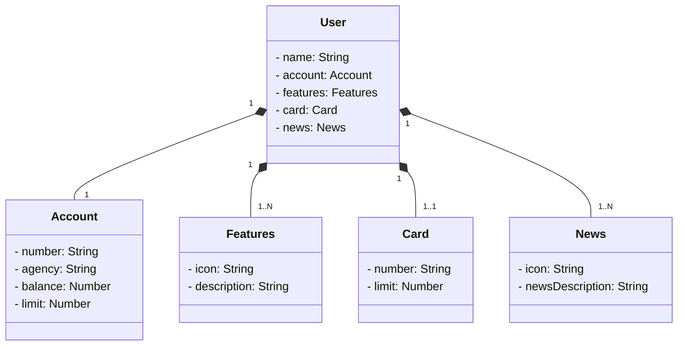

# santander-dev-week-2023
Java RESTful API created for Santander Dev Week

## Classes Diagram

```mermaid
classDiagram
  class User {
    - name: String
    - account: Account
    - features: Features
    - card: Card
    - news: News
  }

  class Account {
    - number: String
    - agency: String
    - balance: Number
    - limit: Number
  }

  class Features {
    - icon: String
    - description: String
  }

  class Card {
    - number: String
    - limit: Number
  }

  class News {
    - icon: String
    - newsDescription: String
  }

  User "1" *-- "1" Account
  User "1" *-- "1..N" Features
  User "1" *-- "1..1" Card
  User "1" *-- "1..N" News
```
